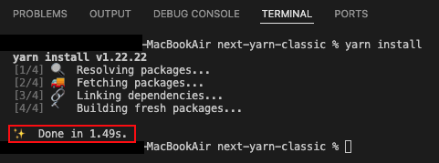
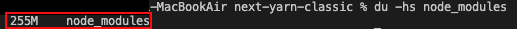
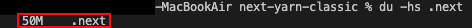
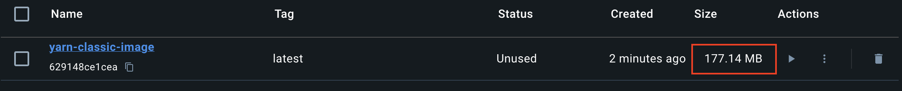
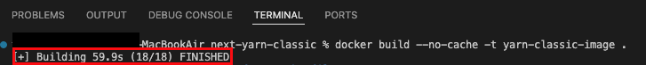
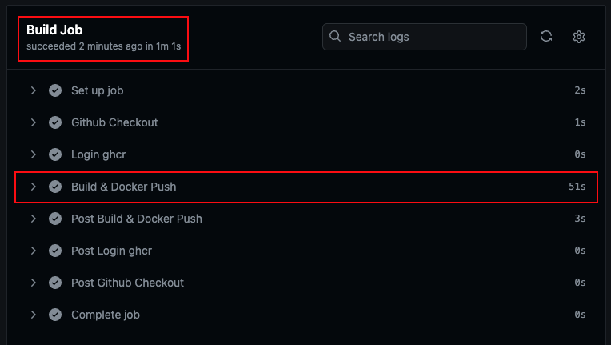

## :memo: Title: next-yarn-classic
패키지 매니저 `Yarn classic v1.22.22`로 빌드한 NextJS 기본 템플릿입니다.  
최초 빌드를 기준으로 하기위해 workflow 캐시 작업은 제외하였습니다.   

---
### 1) [🏠로컬] Dependency install 시간   
|결과: `1.49s`|
|:------|
||
  
### 2) [🏠로컬] Dependency 크기   
|결과: `node_modules: 255M`|
|:------|
||
    
### 3) [🏠로컬] .next 빌드 결과물 크기  
|결과: `.next: 50M`|
|:------|
||   

### 4) [🐳Docker] 로컬 이미지 크기  
|결과: `177.14MB`|
|:------|
||

### 5) [🐳Docker] 로컬 이미지 build 시간 
|결과: `59.5s`|
|:------|
||

### 6) [⚡️Github Actions] CI total workflow 시간 
|결과: `1m 11s`|
|:------|
||

### 7-8) [⚡️Github Actions] Build Job, Build & Docker Push Step 시간 
|Build Job 결과: `1m 1s`, Build & Docker Push Step 결과: `51s`|
|:------|
||

#### :mag: 위 조건들을 기준으로 패키지 매니저별 비교 학습하기 위해 만들었습니다.   
#### :mag: 대략적인 수치를 알기 위한 것으로, 오차가 있을 수 있습니다.

  

## :pushpin: Dev Enviroment
    Node (v20.11.1)  
    Yarn classic (v.1.22.22)  
    NextJS (v.14.2.5), output: standalone    
    Docker (v.27.0.3)   
    Github Actions
    Github Container Registry

## :pushpin: Dev Dependencies
    prettier (v3)